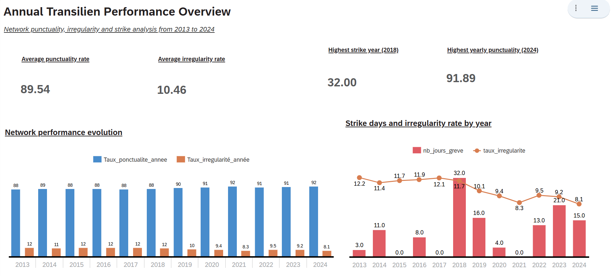
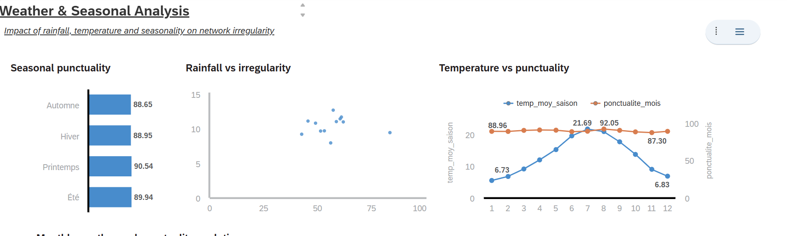
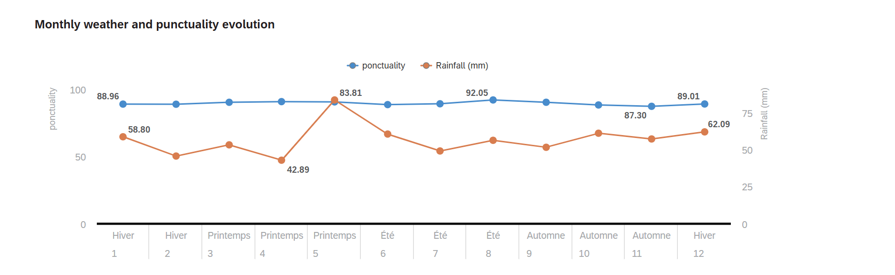
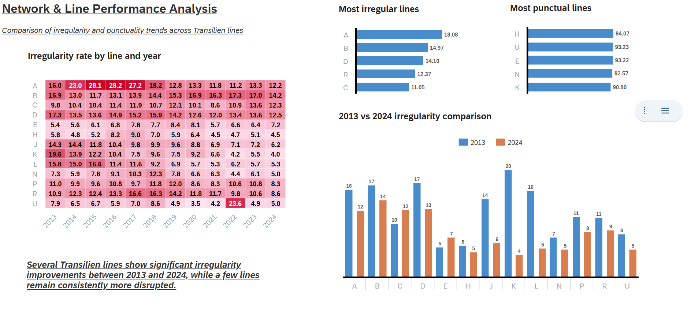

# Transilien Network Performance Analysis

Business Intelligence & Data Analytics project analyzing the impact of weather, strikes and seasonality on Transilien network punctuality between 2013 and 2024.

---

# Project Overview

This project aims to analyze the operational performance of the Transilien railway network using Business Intelligence techniques and interactive dashboards.

The objective was to transform raw punctuality datasets into actionable analytical insights through:
- data preprocessing,
- feature engineering,
- KPI modeling,
- and dashboard storytelling.

The project combines Python data preparation workflows with SAP Analytics Cloud visual dashboards.

---

# Objectives

- Analyze Transilien punctuality evolution from 2013 to 2024
- Study irregularity trends across railway lines
- Measure the influence of:
  - weather conditions,
  - strikes,
  - seasonality,
  - holidays
- Build a complete BI pipeline from preprocessing to dashboards

---

# Datasets Used

## Main Dataset
- Monthly Transilien punctuality dataset

## Additional Enrichment Datasets
- Weather data (rainfall, temperature, wind)
- Strike indicators
- Holiday indicators

---

# Data Preprocessing

Data preprocessing was performed using Python and pandas.

Main preprocessing steps:
- Missing value handling
- Date harmonization
- Dataset merging
- KPI generation
- Feature engineering
- Export of analytical datasets for SAP Analytics Cloud

---

# Feature Engineering

Several analytical features were created:

| Feature | Description |
|---|---|
| `taux_irregularite` | Irregularity rate |
| `saison` | Seasonal categorization |
| `nb_jours_greve` | Number of strike days |
| `pluie_mm` | Monthly rainfall |
| `temperature_moyenne` | Average temperature |
| `vent_moyen` | Average wind speed |

---

# BI Workflow

```text
Raw datasets
↓
Python preprocessing
↓
Feature engineering
↓
Processed analytical datasets
↓
SAP Analytics Cloud dashboards
↓
Business insights
```
---

# SAP Analytics Cloud Dashboards

The project includes several interactive dashboards developed in SAP Analytics Cloud.

---

## Annual Network Performance

Analysis of:
- punctuality evolution,
- irregularity rates,
- strike periods,
- yearly network performance.



---

## Weather & Seasonality Analysis

Analysis of:
- rainfall vs irregularity,
- seasonal punctuality,
- temperature evolution,
- weather impact on performance.




---

## Line Performance Analysis

Analysis of:
- line irregularity heatmaps,
- 2013 vs 2024 comparison,
- best and worst performing lines.



---

## Key Insights

- Global punctuality improved between 2013 and 2024
- Some railway lines remain structurally more irregular
- Weather influence exists but remains moderate
- Strike periods correlate with irregularity peaks

---

# Tech Stack

- Python
- pandas
- NumPy
- Matplotlib
- SAP Analytics Cloud
- Jupyter Notebook

---

## Repository Structure


```text
project/
├── Data/
├── notebooks/
├── screenshots/
├── README.md
└── requirements.txt
```